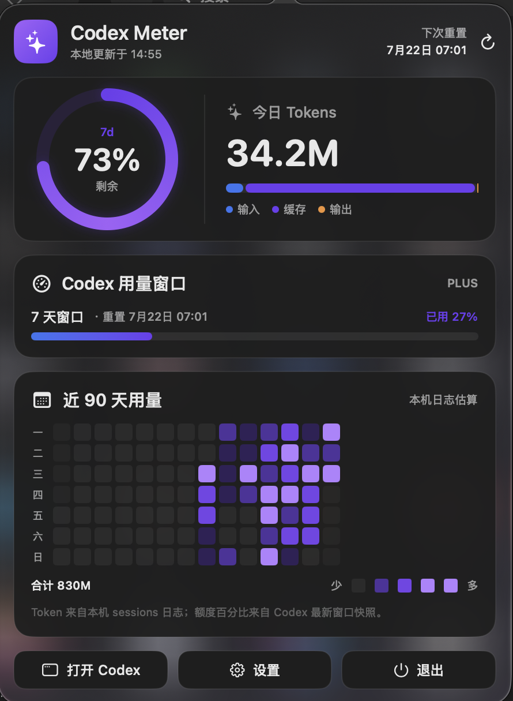

# Codex Meter for macOS

[](https://github.com/catleelee-f/codex-meter-macos/actions/workflows/ci.yml)

维护入口：[贡献指南](CONTRIBUTING.md) · [路线图](ROADMAP.md) · [问题反馈](https://github.com/catleelee-f/codex-meter-macos/issues)

v1.3.0 增加独立离线回归测试与 macOS CI。运行 `bash scripts/test-offline.sh` 即可验证，无需个人会话日志或账号。



A privacy-conscious macOS menu bar app for viewing local Codex token activity and live account-wide Codex quota.

一个原生 macOS 菜单栏小工具，用于查看本机 Codex Token 活动、账号实时额度、用量趋势和项目排行。

> Unofficial community project. Not affiliated with or endorsed by OpenAI.

## Features

- Native AppKit status item with a SwiftUI dashboard
- Live account-wide quota, including usage from other Codex clients
- Remaining percentage and reset time for every available Codex usage window
- Today's input, cached-input, and output token activity
- Dynamic support for one or multiple rate-limit windows
- Daily, weekly, and cumulative 90-day usage views
- Immediate hover details for daily cells, weekly bars, and cumulative usage
- Separate detail window with 7/30/90-day project rankings
- Per-project token share, active days, last activity, and working directory
- Incremental local cache for fast refreshes
- Clear account-live, account-cache, and local-fallback source labels
- Custom sessions directory and 1/5/15-minute refresh intervals
- Universal binary for Apple Silicon and Intel Macs
- No analytics, direct credential reads, or stored account tokens

## Data and privacy

Local token activity is read from JSONL files under:

```text
~/.codex/sessions
```

- Token counts are local estimates derived from `total_token_usage` events. They are not billing records.
- Project rankings group local sessions by `session_meta.payload.cwd`; no conversation content is needed for this aggregation.
- Rate-limit percentages and reset times are fetched through the installed Codex App Server using `account/rateLimits/read`. This reflects the signed-in account across clients, including usage made outside this Mac's local sessions.
- The app does not read `auth.json`, copy credentials, or store account tokens. Codex App Server reuses the existing Codex sign-in and communicates with OpenAI as Codex normally does.
- The account query does not start a model turn. Automatic account sync is limited to once every five minutes; the refresh button requests an immediate update.
- If Codex App Server or the network is unavailable, the app falls back to the latest local `rate_limits` snapshot and labels it clearly because cross-client usage may be missing.
- Codex session-log fields are not a public stable API and may change in future Codex versions.

Live account sync requires a current, signed-in Codex Desktop app or Codex CLI. The local token dashboard still works without it.

## Install

1. Download `CodexMeter-macOS-universal.zip` from [Releases](../../releases/latest).
2. Unzip it and move `CodexMeter.app` to `/Applications`.
3. Launch the app. If Gatekeeper blocks this locally signed build, right-click it in Finder and choose **Open**.
4. The status item shows an icon and the remaining percentage for the longest available window.

Hold `Command` and drag the status item to reposition it.

## Build from source

Requirements:

- macOS 13 or newer
- Xcode Command Line Tools
- Codex Desktop or Codex CLI signed in for live account quota

```bash
git clone https://github.com/catleelee-f/codex-meter-macos.git
cd codex-meter-macos
./scripts/build.sh
```

Artifacts are written to:

```text
outputs/CodexMeter.app
outputs/CodexMeter-macOS-universal.zip
```

To run the parser smoke test against your own local Codex sessions:

```bash
./scripts/test-parser.sh
```

To run an optional live account-sync probe:

```bash
./scripts/test-account-sync.sh
```

## Architecture

- `source/CodexLogScanner.swift` — incremental JSONL scanner and cache
- `source/CodexAccountUsageClient.swift` — read-only Codex App Server account quota client
- `source/UsageStore.swift` — refresh scheduling and preferences
- `source/DashboardViews.swift` — dashboard, heatmap, and settings UI
- `source/DetailsView.swift` — detailed summaries and project ranking UI
- `source/AppDelegate.swift` — status item, popover, and app lifecycle
- `scripts/build.sh` — universal build, ad-hoc signing, and ZIP packaging

## Security

Please report vulnerabilities through GitHub's private vulnerability reporting when available. See [SECURITY.md](SECURITY.md).

Codex App Server integration follows OpenAI's documented JSONL-over-stdio initialization flow. See the [Codex App Server documentation](https://developers.openai.com/codex/app-server/).

## License

MIT License. See [LICENSE](LICENSE).
